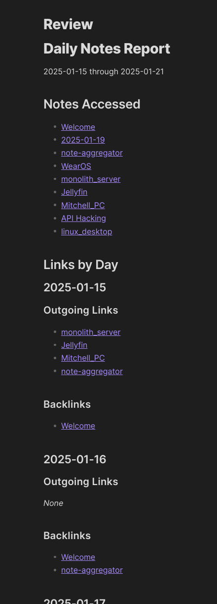
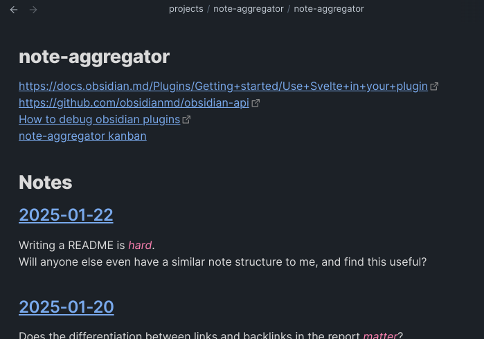

# Daily Note Aggregator
This plugin gathers internal links from Obsidian's built in Daily Notes for a given time span. It gathers both links and backlinks and generates a report summary of all links found per day.

## Why?
To keep track of the projects / notes that have been meaningfully contributed to in a given time span. As a **monthly review** or to prepare for a **weekly check-in meeting**. My memory is *terrible*, and this tool helps to keep track of work.

## The System
This plugin was built to boost productivity with *my note system*.

At home and at work, I have *many* projects in flight at various stages, and may park projects for extended periods of time. I keep track of my work in descrete notes for each project. When I pick up a project, I create an entry that links back to the Daily Note for that day. This way, I can pick up the project with a brief summary of what I did last (a week, month, or year ago).

That looks a bit like this:

While this system has been made to fit into my own note-taking habbits, I believe it will fit into many workflows that include Daily Notes.

## Support
If you encounter any bugs, or have a feature request, please open a ticket. I would love to hear from you.

If this plugin has improved your note system, please let me know at mitchell@mitchellv.ca
If you *really* enjoy what I have made, you could [buy me a coffee :)](https://buymeacoffee.com/mitchellv)
